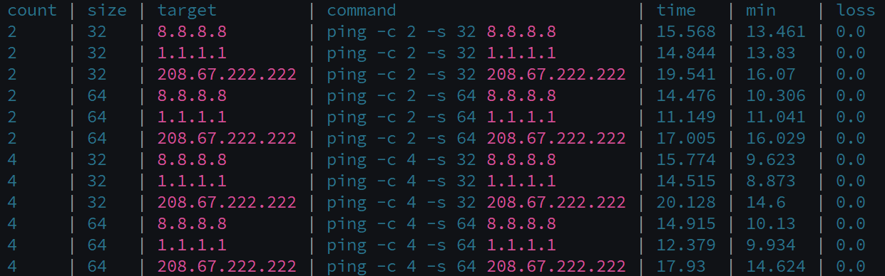

# FlexCartesian

**Ruby implementation of flexible and human-friendly operations on Cartesian products**  


## Features

✅ Named dimensions with arbitrary keys

✅ Enumerate over Cartesian product with a single block argument  

✅ Functions over Cartesian vectors are decoupled from dimensionality

✅ Define conditions on Cartesian combinations using `s.cond(:set) { |v| v.dim1 > v.dim2 } }` syntax

✅ Calculate over named dimensions using `s.cartesian { |v| puts "#{v.dim1} and #{v.dim2}" }` syntax

✅ Add functions over dimensions using `s.add_function { |v| v.dim1 + v.dim2 }` syntax

✅ Lazy and eager evaluation

✅ Progress bars for large Cartesian combinations

✅ Export of Cartesian space to Markdown or CSV

✅ Import of Cartesian space from JSON or YAML

✅ Export of Cartesian space to Markdown or CSV

✅ Structured and colorized terminal output  


## Installation

```bash
bundle install
gem build flex-cartesian.gemspec
gem install flex-cartesian-*.gem
```


## Usage

```ruby
#!/usr/bin/ruby

require 'flex-cartesian'


# BASIC CONCEPTS

# 1. Cartesian object is a set of combinations of values of dimansions.
# 2. Dimensions always have names.

puts "\nDefine named dimensions"
example = {
  dim1: [1, 2],
  dim2: ['x', 'y'],
  dim3: [true, false]
}

puts "\nCreate Cartesian space"
s = FlexCartesian.new(example)

def do_something(v)
  # do something here on vector v and its components 
end


# ITERATION OVER CARTESIAN SPACE

# 3. Iterator is dimensionality-agnostic, that is, has a vector syntax that hides dimensions under the hood.
#    This keeps foundational code intact, and isolates modifications in the iterator body 'do_something'.
# 4. For efficiency on VERY largse Cartesian spaces, there are
#    a). lazy evaluation of each combination
#    b). progress bar to track time-consuming calculations.

puts "\nIterate over all Cartesian combinations and execute action (dimensionality-agnostic style)"
s.cartesian { |v| do_something(v) }

puts "\nIterate over all Cartesian combinations and execute action (dimensionality-aware style)"
s.cartesian { |v| puts "#{v.dim1} & #{v.dim2}" if v.dim3 }

puts "\nIterate and display progress bar (useful for large Cartesian spaces)"
s.progress_each { |v| do_something(v) }

puts "\nIterate in lLazy mode, without materializing entire Cartesian product in memory"
s.cartesian(lazy: true).take(2).each { |v| do_something(v) }


# FUNCTIONS ON CARTESIAN SPACE

# 5. A function is a virtual dimension that is calculated based on a vector of base dimensions.
#    You can think of a function as a scalar field defined on Cartesian space.
# 6. Functions are printed as virtual dimensions in .output method.
# 7. However, functions remains virtual construct, and their values can't be referenced by name
#    (unlike regular dimensions). Also, functions do not add to .size of Cartesian space.

puts "\nAdd function 'triple'"
puts "Note: function is visualized in .output as a new dimension"
s.add_function(:triple) { |v| v.dim1 * 3 + (v.dim3 ? 1: 0) }
# Note: however, function remains a virtual construct, and it cannot be referenced by name
s.output

puts "\Add and then remove function 'test'"
s.add_function(:test) { |v| v.dim3.to_i }
s.remove_function(:test)


# CONDITIONS ON CARTESIAN SPACE

# 8. A condition is a logical restriction of allowed combitnations for Cartesian space.
# 9. Using conditions, you can take a slice of Cartesian space.
#    In particular, you can reflect semantical dependency of dimensional values.

puts "Build Cartesian space that includes only odd values of 'dim1' dimension"
s.cond(:set) { |v| v.dim1.odd? }
puts "print all the conditions in format 'index | condition '"
s.cond
puts "Test the condition: print the updated Cartesian space"
s.output
puts "Test the condition: check the updated size of Cartesian space"
puts "New size: #{s.size}"
puts "Clear condition #0"
s.cond(:unset, index: 0)
puts "Clear all conditions"
s.cond(:clear)
puts "Restored size without conditions: #{s.size}"


# PRINT

puts "\nPrint Cartesian space as plain table, all functions included"
s.output

puts "\nPrint Cartesian space as Markdown"
s.output(format: :markdown)

puts "\nPrint Cartesian space as CSV"
s.output(format: :csv)


# IMPORT / EXPORT

puts "\nImport Cartesian space from JSON (similar method for YAML)"
File.write('example.json', JSON.pretty_generate(example))
puts "\nNote: after import, all assigned functions will calculate again, and they appear in the output"
s.import('example.json').output

puts "\nExport Cartesian space to YAML (similar method for JSON)"
s.export('example.yaml', format: :yaml)


# UTILITIES

puts "\nGet number of Cartesian combinations"
puts "Note: .size counts only dimensions, it ignores virtual constructs (functions, conditions, etc.)"
puts "Total size of Cartesian space: #{s.size}"

puts "\nPartially converting Cartesian space to array:"
array = s.to_a(limit: 3)
puts array.inspect
```

## Example

The most common use case for FlexCartesian is sweep analysis, that is, analysis of target value on all possible combinations of its parameters.
FlexCartesian has been designed to provide a concise form for sweep analysis:

```ruby
require 'flex-cartesian'

# create Cartesian space from JSON describing input parameters
s = FlexCartesian.new(path: './config.json')

# Define the values we want to calculate on all possible combinations of parameters
s.func(:add, :cmd) { |v| v.threads * v.batch }
s.func(:add, :performance) { |v| v.cmd / 3 }

# Calculate
s.func(:run)

# Save result as CSV, to easily open it in any business analytics tool
s.output(format: :csv, file: './benchmark.csv')
# For convenience, print result to the terminal
s.output
```

As this code is a little artificial, let us build real-world example.
Perhaps, we want to analyze PING perfomance from our machine to several DNS providers: Google DNS, CloudFlare DNS, and Cisco DNS.
For each of those services, we would like to know:

- What is our ping time?
- How does ping scale by packet size?
- How does ping statistics vary based on count of pings?

These input parameters form the following dimensions.

```json
{
  "count": [2, 4],
  "size": [32, 64],
  "target": [
    "8.8.8.8",           // Google DNS
    "1.1.1.1",           // Cloudflare DNS
    "208.67.222.222"     // Cisco OpenDNS
  ]
}
```

Note that '//' isn't officially supported by JSON, and you may want to remove the comments if you experience parser errors.
Let us build the code to run over these parameters.

```ruby
require 'flex-cartesian'

s = FlexCartesian.new(path: './ping_config.json') # file with the parameters as given above

result = {} # here we will store raw result of each ping and fetch target metrics from it

# this function shows actual ping command
s.func(:add, :command) do |v|
  "ping -c #{v.count} -s #{v.size} #{v.target}"
end

# this function gets raw result of actual ping command
s.func(:add, :raw_ping, hide: true) do |v|
  result[v.command] ||= `#{v.command} 2>&1`
end

# this function extracts ping time
s.func(:add, :time) do |v|
  if v.raw_ping =~ /min\/avg\/max\/(?:mdev|stddev) = [^\/]+\/([^\/]+)/
    $1.to_f
  end
end

# this function extracts minimum ping time
s.func(:add, :min) do |v|
  if v.raw_ping =~ /min\/avg\/max\/(?:mdev|stddev) = ([^\/]+)/
    $1.to_f
  end
end

# funally, this function extracts losses of ping
s.func(:add, :loss) do |v|
  if v.raw_ping =~ /(\d+(?:\.\d+)?)% packet loss/
    $1.to_f
  end
end

# this is the spinal axis of FlexCartesian:
# calculate all functions on the entire Cartesian space of parameters aka dimensions
s.func(:run)

# save benchmark results to CSV for convenient analysis in BI tools
s.output(format: :csv, file: './benchmark.csv')

# for convenience, show tabular result on screen as well
s.output(colorize: true)
```

If you run the code, after a while you it will generate benchmark results on the screen:



Additionally, CSV version of this result is saved as './benchmark.csv'

The PING benchmarking code above is 100% practical and illustrative.
You can modify it and benchmark virtually anything:

- Local block devices using 'dd'
- GPU-to-Storage connection using 'gdsio'
- Local file systems using FS-based utilities
- Local CPU RAM using RAM disk or specialized benchmarks for CPU RAM
- Database performance using SQL client or non-SQL client utilities
- Performance of object storage of cloud providers, be it AWS S3, OCI Object Storage, or anything else
- Performance of any AI model, from simplistic YOLO to heavy-weight LLM such as LLAMA, Cohere, or DeepSeek
- ... Any other target application or service

In any use case, FlexCartesian will unfold complete landscape of the target performance over all configurable parameters.
As result, you will be able to spot optimal configurations, correlations, bottlenecks, and sweet spots.
Moreover, you will make your conclusions in a justifiable way.

Here is an example of how I used FlexCartesian to [analyze optimal performance/cost of YOLO](https://www.linkedin.com/pulse/comparing-gpu-a10-ampere-a1-shapes-object-oci-yuri-rassokhin-rseqf).

## API Overview

### Initialization
```ruby
FlexCartesian.new(dimensions_hash)
```
- `dimensions_hash`: a hash with named dimensions; each value can be an `Enumerable` (e.g., arrays, ranges).

Example:
```ruby
dimensions = {
  dim1: [1, 2],
  dim2: ['x', 'y'],
  dim3: [true, false]
}

FlexCartesian.new(dimensions)
```

---

### Iterate Over All Combinations
```ruby
# With block
cartesian(dims = nil, lazy: false) { |vector| ... }

# Without block: returns Enumerator
cartesian(dims = nil, lazy: false)
```
- `dims`: optional dimensions hash (default is the one provided at initialization).
- `lazy`: if true, returns a lazy enumerator.

Each combination is passed as a `Struct` with fields matching the dimension names:
```ruby
s.cartesian { |v| puts "#{v.dim1} - #{v.dim2}" }
```

---

### Add / Remove Functions
```ruby
add_function(name, &block)
remove_function(name)
```
- `name`: symbol — the name of the virtual dimension (e.g. `:label`)
- `block`: a function that receives each vector and returns a computed value

Functions show up in `.output` like additional (virtual) dimensions.

Example:
```ruby
s = FlexCartesian.new( { dim1: [1, 2], dim2: ['A', 'B'] } )
s.add_function(:increment) { |v| v.dim1 + 1 }

s.output(format: :markdown)
# | dim1 | dim2 | increment |
# |------|------|--------|
# | 1    | "A"  | 2    |
# | 1    | "B"  | 2    |
# ...
```

> Note: functions are virtual — they are not part of the base dimensions, but they integrate seamlessly in output.

---

### Count Total Combinations
```ruby
size(dims = nil) → Integer
```
Returns the number of possible combinations.

---

### Convert to Array
```ruby
to_a(limit: nil) → Array
```
- `limit`: maximum number of combinations to collect.

---

### Iterate with Progress Bar
```ruby
progress_each(dims = nil, lazy: false, title: "Processing") { |v| ... }
```
Displays a progress bar using `ruby-progressbar`.

---

### Print Table to Console
```ruby
output(
  separator: " | ",
  colorize: false,
  align: false,
  format: :plain  # or :markdown, :csv
  limit: nil
)
```
Prints all combinations in table form (plain/markdown/CSV).  
Markdown example:
```
| dim1 | dim2 |
|------|------|
|  1   | "a"  |
|  2   | "b"  |
```

---

### Import from JSON or YAML
```ruby
import('file.json',
  format: :json) # or :yaml
```

Obsolete import methods:
```ruby
s.from_json("file.json")
s.from_yaml("file.yaml")
```

---

### Export from JSON or YAML
```ruby
export('file.json',
  format: :json) # or :yaml
```

---

### Print Cartesian Space
Each yielded combination is a `Struct` extended with:
```ruby
output(separator: " | ", colorize: false, align: true)
```
Example:
```ruby
s.cartesian { |v| v.output(colorize: true, align: false) }
```

---

### Conditions on Cartesian Space
```ruby
cond(command = :print, # or :set, :unset, :clear
     index: nil, # index of a conditions to unset
     &block # defintiion of the condition to set
     )
```
Example:
```ruby
s.cond(:set) { |v| v.dim1 > v.dim3 }
s.cond # defaults to s.cond(:print) and shows all the conditions in the form 'index | definition'
s.cond(:unset, 0) # remove previously set condition
s.cond(:clear) # remove all conditions, if any
```


## License

This project is licensed under the terms of the GNU General Public License v3.0.  
See [LICENSE](LICENSE) for more details.
