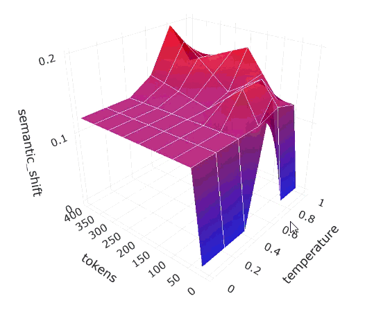

<h1 align="center">FlexCartesian</h1>
<p align="center">
  <b>Model real systems as functions of parameters. Extract behavioural blueprints. Get insights with a few lines of code.</b>
</p>

---

# What Is It?

# What Is It For?

Most of the systems around us _are_ functions of parameters.<br/>

The LLM you are using has inference parameters, and its functions are quality of response, responce time, and throughput.<br/>
The cloud storage you are using has configuration parameters, and its functions are IOPS and throughput.<br/>
Even the car you are driving has driving parameters, and its function is cost per mile.<br/>

In any case, system behaviour characterizes by its function - and you want to tune parameters of the system to optimize its function.<br/>
This woould put the system to the absolute best operatind mode: least cost per mile - highest storage IOPS - lowest response time from LLM.

Hence the fundamental questions.<br/>

<p align="center">
<b>HOW DO PARAMETERS INFLUENCE THE BEHAVIOUR OF THE SYSTEM?</b>
</p>

In particular:

<p align="center">
<b>WHAT IS THE ABSOLUTE BEST OPERATING MODE OF THE SYSTEM?</b>
</p>

If you deal with a system that behaves as a function of multiple tunable parameters, and you want to explore its behaviour, FlexCartesian does it for you.
Effectively, it answers the following questions for your system.

- What parameters are the most influential?
- Is the influence of parameters linear or chaotic?
- What parameters can be ignored as negligible?
- Which parameters are independent and which ones are inter-correlated?
- How does the system's behaviour evolve in time?

Fundamentally, this exploration conveys an answer to one fundamental question: ***"what is the absolute best operating mode of my system?"*** This is precisely the core value of FlexCartesian - it finds the best operating mode for your system for any target metric you want, be it highest throughput, highest semantic consistency, lowest latency, or anything else.

## What Systems Can FlexCartesian Explore?

Any system can be explored, as long as you can measure its behaviour.
For example, FlexCartesian has been used for the following systems in real-world large-scale projects.

| System Explored | Research Question | Answer Conveyed |
| --------------- | ----------------- | --------------- |
| LLM (ChatGPT, Cohere, LLAMA, Qwen, JAIS) | What temperature/token combinations are optimal for maintaining stable and consistent LLM's answers to repeated questions? | Tier-1 LLMs are very stable with the temperature <= 0.2 and ~1,000 tokens, at least |
| Vision models (YOLO, Detectron) | Which architecture leads by performance/ratio for 100,000,000 detections/day, GPU or ARM? | Surprisingly, it's ARM in many use cases |
| Semantic search (FAISS and lots of embedding models) | Should semantic index be preloaded to memory, and which one - CPU or GPU? | Preloading makes difference. Suprisingly, preloading to cheaper CPU RAM often brings nearly the same acceleration as limited and costly GPU RAM |
| Cloud storage tuning | What is time gap of AI training on OCI using local NVMe versus network-attached block volumes? | It's less than 20%, often ~10% |

In general, FlexCartesian brings value in any use case where you need to systematically explore the entire parameter space of viable values of input parameters. These are performance benchmarking of infrastructure; tuning of AI/ML models; generating simulations in physics or bioinformatics; generating API stress-tests; generating full-coverate test scripts, and many more.

Any field involving ***iteration over multi-dimensional parameter space*** benefits from FlexCartesian.

## Essential Advantages

FlexCartesian takes the paradigm known as **parameter space analysis** to the next level we call **Parametric Behaviour Blueprinting (PBB)**.

1. You define input parameters of your system, and constraints, if any.
2. You express behavioural functions of your system - this can be probes fetching metrics from your system, or built-in connectors to the data source storing metrics of your system.
3. FlexCartesian builds multi-dimensional Cartesian space of the parameters, and computes behavioural functions in this space - with respect to constraints, if any.
4. From now on, FlexCartesian holds Parametric Behavioural Blueprint of your system - and it gives you all the power of the BPP paradigm:

- You can visualize interactive heatmaps of your system's behaviour
- You can analyze influence of the parameters on the behaviour of the system
- You can find sweet-spot combinations of parameter values
- You can enrich your system by adding derived behavioural functions, and further explore its behaviour
- You can keep the link between the blueprint and real system alive, so that the blueprint will evolve in time, just as real system does

Effectively, FlexCartesian creates a live digital blueprint of your system, serving as the engine for mathematical modelling linked to real system.

## Example #1: Avoiding semantic shift in ChatGPT

Perhaps, we want to find optimal operating mode of ChatGPT - specifically, the ranges of its temperature and tokens where ChatGPT gives stable and consistent answers to repeated question. The lack of such stability is called semantic shift, which is crucial to avoid in such fields as law or science, where AI assistant must provide very stable answers based on a given corpus of documents. While you can run [this example](https://github.com/Yuri-Rassokhin/flex-cartesian/tree/main/examples/13_chatgpt_semantic_shift) yourself, here's how FlexCartesian suggests ChatGPT's operating mode free from semantic shift, step by step.

Enable FlexCartesian:

```ruby
require 'flex-cartesian'
```

Define parameter space:

```ruby
space = FlexCartesian.new({
		temperature: [0.0, 0.2, 0.4, 0.6, 0.8, 1.0],
		tokens: [20, 50, 100, 200, 400]})
```

Define behavioural function `response` - for any combinations of parameters, it returns response given by ChatGPT to the same test question.

```ruby
msg = [ { role: "system", content: "You are a precise and consistent assistant." },
        { role: "user", content: "Explain quantum mechanics in one sentence." } ]

space.func(:add, :response) { |v| llm(temperature: v.temperature, max_tokens: v.tokens, messages: msg ) }
```

Enrich the system by two more behavioural functions.
For any answer provided by `response` function, the function `embedding` returns its vector embedding, and `semantic_drift` calculates how far the response drifts away from the very first answer (`anchor`) given by ChatGPT. The values of `semantic_shift` is precisely what we need!

```ruby
space.func(:add, :embedding) { |v| anchor ||= embed(v.response); embed(v.response) }
space.func(:add, :semantic_shift) { |v| (1.0 - cosine(v.embedding, anchor)).round(2) }
```

Then we compute all the functions in the entire parameter space.
Behind the scene, FlexCartesian iterates each function over all combinations of parameters.

```ruby
space.func(:run. progress: true)
```

Upon completion, FlexCartesian holds PBB (Parametric Behavioural blueprint) of our system, ChatGPT.
Now we can visualize PBB as a fancy 2D-heatmap showing how semantic of ChatGPT's answers depends on tokens and temperature.

```ruby
space.visualize(x: :temperature, y: :tokens, func: :semantic_shift, output: "./viz.html")
```

We can open this `./viz.html` in a browser.
The semantic shift varies from 0.0 (the answer is identical to the first answer) to 1.0 (the answer is totally inconsistent from the first answer):

<p align="center">
	
</p>

The heatmap suggests the answer to the initial question. To avoid semantic shift completely, we should keep temperature not exceeding 0.2, while the number of tokens has no influence to the responses at all. By the way, even with the temperatures beyond 0.2, the answering is still respectably consistent - the semantic shift hardly reaches 0.2.

Finally, we want to assess the influence of each parameter on the semantic shift of ChatGPT's answers.

```ruby
space.analyzer(:morris, trajectories: 10, step: 0.1, seed: 42).output(func: :semantic_shift, format: :markdown)
```

This will produce Markdown table of the quantified influence and the nature of influence of the parameters:

|parameter  |influence[semantic_shift]|deviation|probes|category|linearity        |recommendation                                                                                   |
|-----------|-------------------------|---------|------|--------|-----------------|-------------------------------------------------------------------------------------------------|
|tokens     |0.14                     |0.22     |10    |strong  |highly non-linear|critical parameter with complex interactions; prioritize for variance-based analysis (e.g. Sobol)|
|temperature|0.09                     |0.19     |10    |strong  |highly non-linear|critical parameter with complex interactions; prioritize for variance-based analysis (e.g. Sobol)|

This sensitivity table confirms strong influence of both parameters on the consistency of the answers, and most importantly, it categorizes their influence as highly non-linear. Therefore, we should NOT make decisions on these parameters based on a few probes - to the contrary, we have to build complete behavioural bluepring using entire parameter space - and find sweet area on it: "temperature <= 0.2, no matter the tokens".

## Example #2: Sensitivity of AWS DynamoDB servers

Let's take [another example](https://github.com/Yuri-Rassokhin/flex-cartesian/tree/main/examples/09_ping_visualize).
If we ping AWS DynamoDB, how do ping parameters influence ping time?
For the sake of example, let's take IP address and packet size.
Here's full code, showing how FlexCartesian gives the answer.

```ruby
# enable FlexCartesian
require 'flex-cartesian'

# define parameter space
space = FlexCartesian.new({
  size: [64, 512, 1400, 1500, 4096, 8192],
  target: [ "dynamodb.eu-central-1.amazonaws.com",   # Frankfurt
	    "dynamodb.us-east-1.amazonaws.com",      # Virginia, US
	    "dynamodb.sa-east-1.amazonaws.com",      # Sao Paolo
	    "dynamodb.ap-northeast-1.amazonaws.com", # Tokio
	    "dynamodb.af-south-1.amazonaws.com"]})   # Capetown

# define behavioural functions:
# 1. 'command' constructs ping command
# 2. 'raw' executes the command and returns raw result
# 3. 'time' extracts ping time from the result
# 4. 'cap' is a fancy stuff, it shows 150 ms ping threshold on the future visialization.
result = {}
space.func(:add, :command) { |v| "ping -c #{v.count} -s #{v.size} -i #{v.interval} #{v.target}" }
space.func(:add, :raw, hide: true) { |v| result[v.command] ||= `#{v.command} 2>&1` }
space.func(:add, :time) { |v| v.raw[/min\/avg\/max\/(?:mdev|stddev) = [^\/]+\/([^\/]+)/, 1]&.to_f.round(2) }
space.func(:add, :cap) { |v| 150 }

# Now we compute all the functions in the parameter space
space.func(:run, progress: true)

# Visualize behavioural blueprint as a 2D-heatmap
# It will show two functions - ping time (:time) and 150ms threashold (:cap)
space.visualize(x: :size, y: :target, func: [ :time, :cap ], output: "./viz.html")
```

Just run this code, and you'll get an interactive HTML heatmap `./viz.html` showing how geography and packet size influence ping to DynamoDB.
As you can see, FlexCartesian enables very high-level and powerful DSL, packing complex operations to one-liners.
If you need mathematically rigorous assessment of the parameter influence, you just add yet another one-liner:

```ruby
space.analyzer(:morris, trajectories: 10, step: 0.1, seed: 42).output(func: :time)
```

This one-liner applies [Morris sensitivity analysis](https://en.wikipedia.org/wiki/Morris_method) to the behavioural blueprint extracted by FlexCartesian.

## API Documentation

Please have it [here](docs/api/api.md).

## Installation

```bash
gem install flex-cartesian
```

## License

This project is licensed under the terms of the GNU General Public License v3.0. See [LICENSE](LICENSE) for more details.
