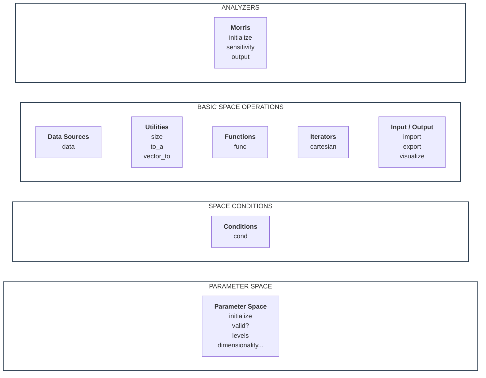

```mermaid
flowchart TB
    classDef layer fill:#ffffff,stroke:#2c3e50,stroke-width:2px;
    classDef ghost fill:transparent,stroke:transparent,color:transparent;

    subgraph Analyzers ["ANALYZERS"]
        direction LR
        gA1["xxxxxxxxxxxxxxxxxxxxxxxxxxxxxxxxxxxxxxxx"]:::ghost ~~~ M["<b>Morris</b><br/>initialize<br/>sensitivity<br/>output"] ~~~ gA2["xxxxxxxxxxxxxxxxxxxxxxxxxxxxxxxxxxxxxxxx"]:::ghost
    end

    subgraph Core ["BASIC SPACE OPERATIONS"]
        direction LR
        DS["<b>Data Sources</b><br/>data"] ~~~ UT["<b>Utilities</b><br/>size<br/>to_a<br/>vector_to"] ~~~ FN["<b>Functions</b><br/>func"] ~~~ IT["<b>Iterators</b><br/>cartesian"] ~~~ IO["<b>Input / Output</b><br/>import<br/>export<br/>visualize"]
    end

    subgraph Cond ["SPACE CONDITIONS"]
        direction LR
        gC1["xxxxxxxxxxxxxxxxxxxxxxxxxxxxxxxxxxxxxxxx"]:::ghost ~~~ C["<b>Conditions</b><br/>cond"] ~~~ gC2["xxxxxxxxxxxxxxxxxxxxxxxxxxxxxxxxxxxxxxxx"]:::ghost
    end

    subgraph Params ["PARAMETER SPACE"]
        direction LR
        gP1["xxxxxxxxxxxxxxxxxxxxxxxxxxxxxxxxxxxxxxxx"]:::ghost ~~~ PS["<b>Parameter Space</b><br/>initialize<br/>valid?<br/>levels<br/>dimensionality..."] ~~~ gP2["xxxxxxxxxxxxxxxxxxxxxxxxxxxxxxxxxxxxxxxx"]:::ghost
    end

    Analyzers ~~~ Core
    Core ~~~ Cond
    Cond ~~~ Params

    class Analyzers,Core,Cond,Params layer;
```
