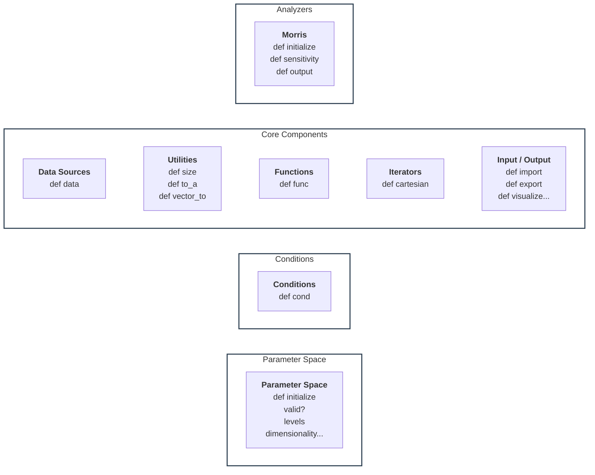

```mermaid
flowchart TB
    %% Стили для сплошных контейнеров
    classDef layer fill:#ffffff,stroke:#2c3e50,stroke-width:2px;
    
    subgraph Analyzers ["Analyzers"]
        M["<b>Morris</b><br/>def initialize<br/>def sensitivity<br/>def output"]
    end

    subgraph Core ["Core Components"]
        direction LR
        DS["<b>Data Sources</b><br/>def data"] ~~~ UT["<b>Utilities</b><br/>def size<br/>def to_a<br/>def vector_to"] ~~~ FN["<b>Functions</b><br/>def func"] ~~~ IT["<b>Iterators</b><br/>def cartesian"] ~~~ IO["<b>Input / Output</b><br/>def import<br/>def export<br/>def visualize..."]
    end

    subgraph Cond ["Conditions"]
        C["<b>Conditions</b><br/>def cond"]
    end

    subgraph Params ["Parameter Space"]
        PS["<b>Parameter Space</b><br/>def initialize<br/>valid?<br/>levels<br/>dimensionality..."]
    end

    %% Невидимые связи заставляют слои выстраиваться строго сверху вниз без стрелок
    Analyzers ~~~ Core
    Core ~~~ Cond
    Cond ~~~ Params

    %% Применяем стили
    class Analyzers,Core,Cond,Params layer;
```

