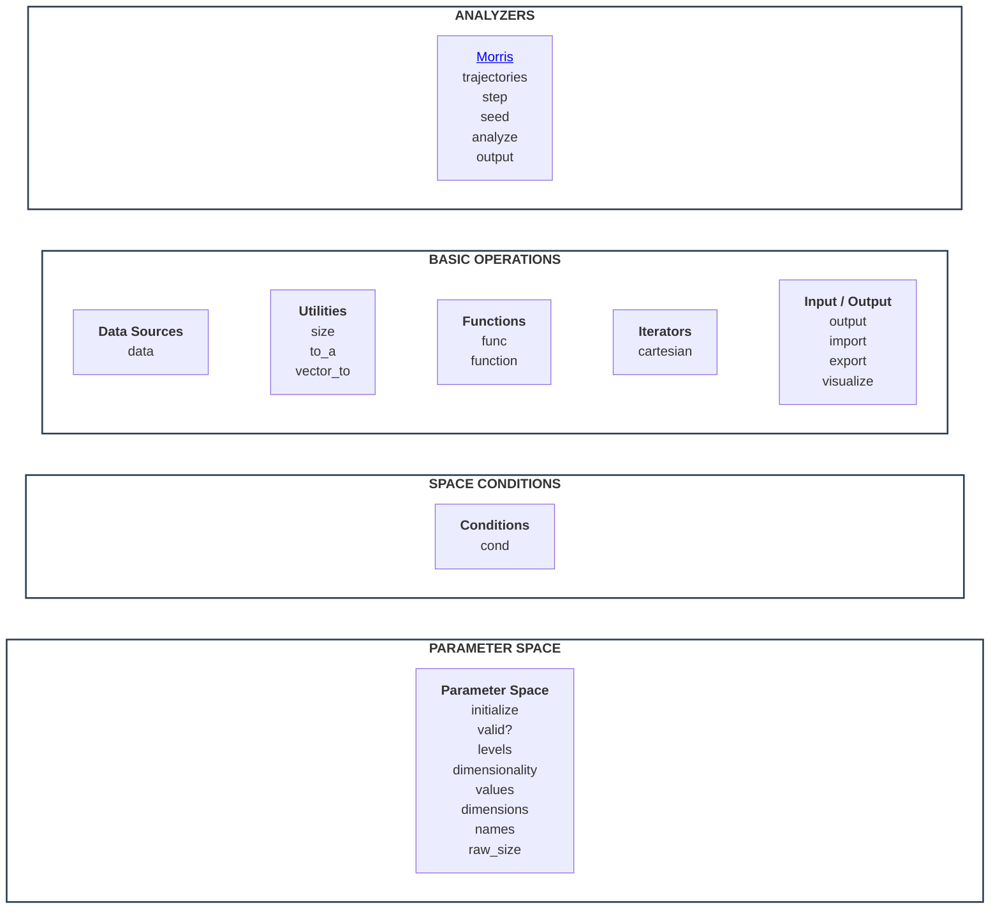

# FlexCartesian Stack

FlexCartesian represents a system using Parametric Behaviour Blueprinting stack, as given below.
Component titles are clickable, and they refer to the description and API of the component.



## STACK COMPONENTS

### PARAMETER SPACE

Parameter space is a space formed as multi-dimensional Cartesian product of the dimensions represented by discrete dimensional values.

```ruby
def initialize(dims = nil, path: nil, format: :json, source: nil, uri: nil, dimensions: nil, separator: ',')
```

Create parameter space. A space can be created in two ways.

Firstly, an empty space can be created from the description of dimensions:

- `dims` hash of dimensions (key) and array of dimensional values (value)
- `path` to the file describing dimensions
- `format` format of the file describing dimensions, either JSON or YAML

Secondly, a space can be created from a tabular data source. In this approach, dimensions are automatically created from specified columns in the data source, and dimensional values will be filled in from these columns. The resulting space will be empty, but entire the data source will remain available to link the data to behavioural functions, if needed. This method is very powerful - effectively, it allows for the creation of a live behavioural blueprint which evolves in time synchronously with the evolution of the data in the data source.

- `source` data source type, one of `:xlsx` or `:csv`
- `uri` local path to the data source file
- `dimensions` array of symbolic column names in the data source that will become space dimensions
- `separator` separation symbol in the data source file, either colon or semicolon

```ruby
def valid?(vector)
```

Check if `vector` is consistent - that is, it has consistent dimensiality, consistent dimensional values, and satisfies conditions in the current space.

```ruby
def values
```

Return array of arrays of dimensional values.

```ruby
def dimensiality
```

Return number of dimensions in the current space.

```ruby
def dimensions
```

Return hash of dimension name (key) referring to array of dimensional values.

```ruby
def names
```

Return array of dimension names.

```ruby
def levels
```

Return array of arrays of dimensional values.

```ruby
def raw_size
```

Return amount of all vectors in the parameter space, ignoring space conditions.
This is a low-level method; high-level `size` respects space conditions.


### SPACE CONDITIONS

Condition is a logical function defined in parameter space.
Condition restricts the space to the subset of vectors that satisfy this condition.

A space can have arbitraty number of conditions, and they apply using logical AND.
This means, conditions restrict the space to the subset that satisfies ALL of them.

All layers of the stack higher up respect conditions - that is, when a method applies to space, effectively it applies only to its subset defined by the conditions.
For example, if `cartesian` iterator iterates over space, it actually iterates over its subset defined by the conditions.

```ruby
  def cond(command = :print, index: nil, &block)
```

Manage conditions in the space.

- `command` `:print` prints active space conditions, `:set` adds new conditions as a block, `:unset` removes specific condition by its `index` or all conditions if `index` isn't specified
- `index` identifies condition set in the space; index is assigned automatically, because conditions have no names (unlike functions)
- `block` body of the condition being added; it must return either `true` or `false`


### BASIC OPERATIONS

#### Functions

```ruby
def func(command = :print, *names, hide: false, progress: false, title: "Computing function(s)", order: nil, &block)
```

- `command` `:print` print the list of defined functions (including their bodies), either all or specified by `names`,
            `:add` add new function or functions defined by symbolic `names`,
            `:del` delete function or functiosn given by `names`
            `:run` calculate all or specified functions in the space
- `names` list of function names
- `hide` do no show specified function(s) being added in the `output` - this is useful for intermediate calculations, irrelevant for the final result
- `progress` show or hide progress bar - this is useful for long-running computations of heavy functions on large space
- `title` custom title for the progress bar
- `order`: can be `:first` or `:last` to make the function calculate before or after all other functions
- `block`: body of the function(s) being added

Plese note that any functions returns `nil` unless it has been computed.
Also, a function will return `nil` in the vector that doesn't satisfy space conditions.

```ruby
def function
```

Return function value in a given vector of the parameter space.
As this method is used often (including conditions and custom code), it is intentionally separated from the wrapper method `func` for the sake of syntax brevity.

- `vector` is the vector
- `function` symbol referring to a function defined in the parameter space.
- `substitute` = 0 what to return if the function is not defined in `vector` (that is, returns `nil`).

This method can enforce `substitute` value if the functions has not been computed or is undefined in the `vector` due to space conditions.

#### Iterators

```ruby
def cartesian(dims = nil, lazy: false, progress: false, title: "Iterating over parameter space")
```

- `dims` iterate over given description of the dimensions, if specified; by default, iterate over the current space
- `lazy` whether or not materialize all vectors of the space in memory
- `progress` show or hide progress bar
- `title` custom title for the progress bar

#### Data Sources

```ruby
def data(command, vector: nil, target: nil )
```

Manage tabular data source.
Currently, it only supports access to the data source linked to the space using `source` flag during creation of the space.

- `command` currently, only `:get` is supported to fetch data from the data source.
            For a given `vector`, it returns the first line with the dimensional columns corresponding to `vector`.
            At the surface, `:get` resembles MS Excel `lookup`. Given a tabular data, it searches the first line with specified values in specified columns, and then returns the value stored in another (specified) field of this line.
- `vector` from the parameter space that is linked to the data source
- `target` which column of the line to return

The `data` method is very powerful for:
- Creation of behavioural blueprints from external tabular sources, such as XLSX or CSV. It allows to extend FlexCartesian modelling capabilities to legacy data sources that hasn't been designed for it.
- Saving and loading the entire blueprtins, including dimensions and computed functions with all their values. This allows for a stateful, cross-session use cases of FlexCartesian.

#### Utilities

```ruby
def size
```

Return amount of of the vectors in the parameter space with respect to conditions.

```ruby
def to_a(vector = nil, limit: nil)
```

Converts `vector` from the space to array, or the first `limit` vectors to arrays, or the entire space to arrays.

```ruby
def vector_to(v, type)
```

Converts vector from the space to a different type. Currently, only `:hash` is supported.

#### Input / Output

```ruby
def output(separator: " | ", colorize: false, align: true, format: :plain, limit: nil, file: nil)
```

A universal method that prints tabular data, such as function values in the space, or results produced by analyzers.
This method is implemented for space, but higher-level objects extend it with their specific parameters.

- `separator` the symbol separating columns in the tabular output; it will be validated for such formats as Markdown or CSV
- `colorize` whether or not make the output colourful; it is automatically disabled if the output goes to file
- `align` whether or not align content to make the columns look accurate
- `format` how to structure output, one of `:plain`, `:csv`, or `:markdown`
- `limit` for the number of lines in the output - useful with very large parameter spaces
- `file` output to the file, if specified

```ruby
def import(path, format: :json)
```

For the current space, create its dimensions using their description in the file.

- `path` the file storing description of the dimensions
- `format` format of the description, either `:yaml` or `:json`

```ruby
def export(path, format: :json)
```

For the current space, save its dimensions to file.

- `path` the file to store dimensions
- `format` format of the description, either `:yaml` or `:json`

```ruby
def visualize(x:, y:, func:, output: nil, text: :dark, show_legend: false, show_z_title: true, show_grid: true, equal_axes: true, start_at_zero: true, show_plot_title: false, bg_color: 'transparent', font_color: nil, grid_color: nil, colorscale: 'Bluered')
```

Generate HTML with an interactive visualization of the blueprint.
Currently, it only generates 2D-surfaces (that is, visualizes functions of 2 parameters).

Basic parameters:

- `x` symbolic name of the dimension that will be X-axis
- `y` symbolic name of the dimension that will be Y-axis
- `func` symbolic name, or an array of symbolic names, of the function(s) that will be visualized

Output parameter:

- `output` output file, defaults to stdout

Visual style parameters:

- `text` shade of textual information on the visualization, either `:dark` or `:light` - useful if you intend put the visualization on a customly colored backgound
- `show_legend` show/hide color legend
- `show_z_title` show/hide the title of Z-axis (the one with function results)
- `show_grid` show/hide coordinate grid
- `equal_axes` whether or not equalize the lengthes of all axes; usually, default equalization looks cool - but you may want to disable it to show true scale of the function results, for instance
- `start_at_zero` enforce the axes to start from zero value, even if their dimensional values start from a different value; usually it is useful to keep this option enabled for the visual consistency
- `show_plot_title` show title of the chart at the top in the form of a function of parameters
- `bg_color` customize background color of the visualization
- `font_color` enforce custom font color; in most cases, you don't need it as FlexCartesian will adapt the color itself
- `grid_color` enforce custom grid color; in most cases, you don't need it as FlexCartesian will adapt the color itself
- `colorscale` customize color gradient of the visualization

### ANALYZERS

An analyzer is a higher-level concept on top of functions.
While value of a function is defined *locally* in a given vector, an analyzer introduces *global* calculations, where resulting value depends on *wider area* of the parameter space, including the entire space, particularly.

Analyzers are instumental in such global calculations as:

- Sensitivity analysis of a given function in the space
- Calculating statistical characteristics of a function - average, median, etc
- Spotting local or global extremal values
- Spotting areas of unusual behaviour of a function

All analyzers share the following methods:

```ruby
def analyzer(type, **opts)
```

Return new analyzer object attached to the current space.

- `type` of the analyzer; currently, only `:morris` is supported
- `opts` are analyzer-specific options (see below)

```ruby
def name
```

Return human-readable name of the analyzer, ex.: "Morris sensitivity analysis".

```ruby
def description
```

Return extended description of the analyzer, ex.: "Morris method explores the parameter space by changing one parameter at a time across multiple trajectories, and quantifies rate and linearity of its influence on the target function".

```ruby
def complexity
```

Return computational complexity of the analyzer in textual form, ex.: "O( dimensions · trajectories )".

```ruby
def category
```

Return wider category the analyzer belong to, ex.: "Sensitivity analysis".

```ruby
def url
```

URL containing description of the method implemented in the analyzer, ex.: "https://en.wikipedia.org/wiki/Morris_method".

#### Morris Analyzer

Specific options required to create Morris analyzer:
- `trajectories` number of random trajectories in the parameter space. In the context of FlexCartesian, trajectories do respect space conditions. A trajectory tries its best to find a valid next step according to conditions, and give up trying only if there's no option to make any next step at all. This is not a bug, rather a feature of the modelling approach. Please note that too many conditions in the space may restrict trajectories too aggressively - in such case, Morris may provide impractical or misaligned assessments.
- `step` width of a step in the trajectory, defaults to 0.1. It must be decimal from (0..1) range, interpreted as a percentage of the number of values in a dimension. Such relativity is critical for the Morris algorithm to treat all dimensions fairly. Otherwise, scarce dimensions would have been investigated disproportionally scarcely.
- `seed` custom random seed, optional

These options remain available as accessors: `def trajectories`, `def step`, and `def seed` upon creation of the analyzer.

```ruby
def analyze(func:)
```

Run Morris analysis for the given function in the current space.

```ruby
def output(func:, categorize: true, recommend: true, **opts)
```

Print results of Morris analysis for the `func` function.
If this analyzer has performed this analysis before, then the results will be reused.
Otherwise, this method will invoke `analyze` under the hood and store the result in the analyzer for the reuse in future outputs.

Please note that semantics of `output` is intentionally lazy.
It allows for the output of the same analysis multiple times (in different formats, etc) without the need for recomputation.
Also, it keeps analysis result identical across repeated output.

If you need to update analysis result, just use `analyze`.

- `func` symbolic name of the function in the parameter space
- `categorize` show or hide categorization of the parameters of the function by their influence and linearity
- `recommend` show or hide recommended next steps based on categorization of the parameters
- `opts` generic options of `output` as it is defined in parameter space

