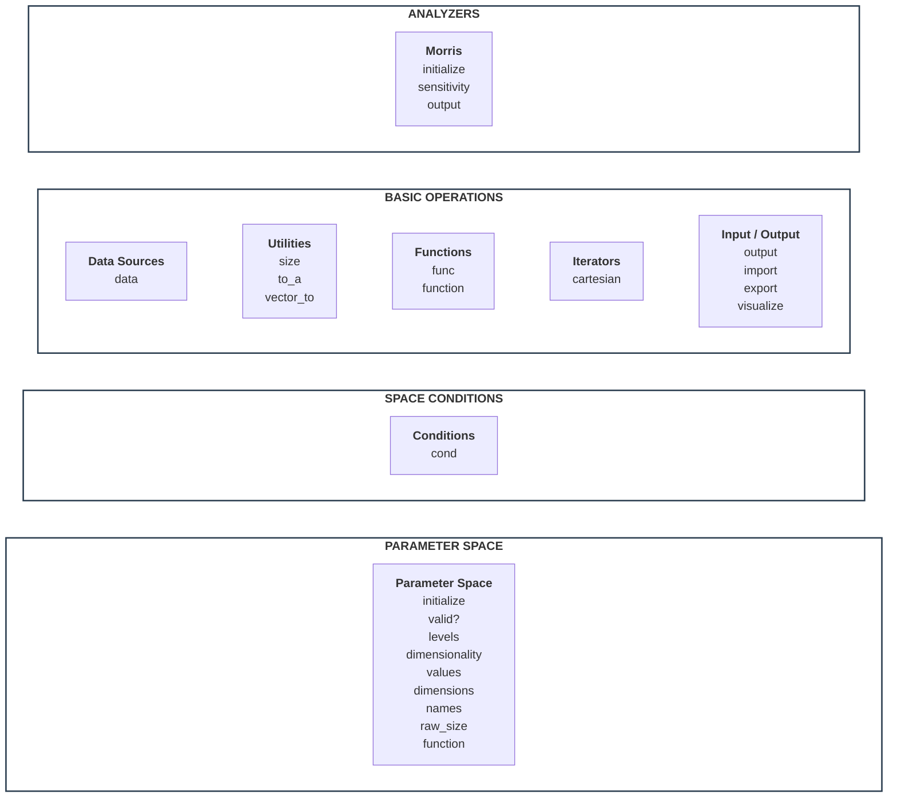

# FlexCartesian Stack

FlexCartesian represents a system using Parametric Behaviour Blueprinting stack, as given below.
Component titles are clickable, and they refer to the description and API of the component.



## STACK COMPONENTS

### PARAMETER SPACE

Parameter space is a space formed as multi-dimensional Cartesian product of the dimensions represented by discrete dimensional values.

```ruby
def initialize(dims = nil, path: nil, format: :json, source: nil, uri: nil, dimensions: nil, separator: ',')
```

Create parameter space. A space can be created in two ways.

Firstly, an empty space can be created from the description of dimensions:

- `dims` hash of dimensions (key) and array of dimensional values (value)
- `path` to the file describing dimensions
- `format` format of the file describing dimensions, either JSON or YAML

Secondly, a space can be created from a tabular data source. In this approach, dimensions are automatically created from specified columns in the data source, and dimensional values will be filled in from these columns. The resulting space will be empty, but entire the data source will remain available to link the data to behavioural functions, if needed. This method is very powerful - effectively, it allows for the creation of a live behavioural blueprint which evolves in time synchronously with the evolution of the data in the data source.

- `source` data source type, one of `:xlsx` or `:csv`
- `uri` local path to the data source file
- `dimensions` array of symbolic column names in the data source that will become space dimensions
- `separator` separation symbol in the data source file, either colon or semicolon

```ruby
def valid?(vector)
```

Check if `vector` is consistent - that is, it has consistent dimensiality, consistent dimensional values, and satisfies conditions in the current space.

```ruby
def values
```

Return array of arrays of dimensional values.

```ruby
def dimensiality
```

Return number of dimensions in the current space.

```ruby
def dimensions
```

Return hash of dimension name (key) referring to array of dimensional values.

```ruby
def names
```

Return array of dimension names.

```ruby
def levels
```

Return array of arrays of dimensional values.

```ruby
def raw_size
```

Return amount of all vectors in the parameter space, ignoring space conditions.
This is a low-level method; high-level `size` respects space conditions.


### SPACE CONDITIONS

Condition is a logical function defined in parameter space.
Condition restricts the space to the subset of vectors that satisfy this condition.

A space can have arbitraty number of conditions, and they apply using logical AND.
This means, conditions restrict the space to the subset that satisfies ALL of them.

All layers of the stack higher up respect conditions - that is, when a method applies to space, effectively it applies only to its subset defined by the conditions.
For example, if `cartesian` iterator iterates over space, it actually iterates over its subset defined by the conditions.

```ruby
  def cond(command = :print, index: nil, &block)
```

Manage conditions in the space.

- `command` `:print` prints active space conditions, `:set` adds new conditions as a block, `:unset` removes specific condition by its `index` or all conditions if `index` isn't specified
- `index` identifies condition set in the space; index is assigned automatically, because conditions have no names (unlike functions)
- `block` body of the condition being added; it must return either `true` or `false`


### BASIC OPERATIONS

#### Functions

```ruby
def func(command = :print, *names, hide: false, progress: false, title: "Computing function(s)", order: nil, &block)
```

- `command` `:print` print the list of defined functions (including their bodies), either all or specified by `names`,
            `:add` add new function or functions defined by symbolic `names`,
            `:del` delete function or functiosn given by `names`
            `:run` calculate all or specified functions in the space
- `names` list of function names
- `hide` do no show specified function(s) being added in the `output` - this is useful for intermediate calculations, irrelevant for the final result
- `progress` show or hide progress bar - this is useful for long-running computations of heavy functions on large space
- `title` custom title for the progress bar
- `order`: can be `:first` or `:last` to make the function calculate before or after all other functions
- `block`: body of the function(s) being added

Plese note that any functions returns `nil` unless it has been computed.
Also, a function will return `nil` in the vector that doesn't satisfy space conditions.

```ruby
def function
```

Return function value in a given vector of the parameter space.
As this method is used often (including conditions and custom code), it is intentionally separated from the wrapper method `func` for the sake of syntax brevity.

- `vector` is the vector
- `function` symbol referring to a function defined in the parameter space.
- `substitute` = 0 what to return if the function is not defined in `vector` (that is, returns `nil`).

This method can enforce `substitute` value if the functions has not been computed or is undefined in the `vector` due to space conditions.

#### Iterators

```ruby
def cartesian(dims = nil, lazy: false, progress: false, title: "Iterating over parameter space")
```

- `dims` iterate over given description of the dimensions, if specified; by default, iterate over the current space
- `lazy` whether or not materialize all vectors of the space in memory
- `progress` show or hide progress bar
- `title` custom title for the progress bar

#### Data Sources

```ruby
def data(command, vector: nil, target: nil )
```

Manage tabular data source.
Currently, it only supports access to the data source linked to the space using `source` flag during creation of the space.

- `command` currently, only `:get` is supported to fetch data from the data source.
            For a given `vector`, it returns the first line with the dimensional columns corresponding to `vector`.
            At the surface, `:get` resembles MS Excel `lookup`. Given a tabular data, it searches the first line with specified values in specified columns, and then returns the value stored in another (specified) field of this line.
- `vector` from the parameter space that is linked to the data source
- `target` which column of the line to return

The `data` method is very powerful for:
- Creation of behavioural blueprints from external tabular sources, such as XLSX or CSV. It allows to extend FlexCartesian modelling capabilities to legacy data sources that hasn't been designed for it.
- Saving and loading the entire blueprtins, including dimensions and computed functions with all their values. This allows for a stateful, cross-session use cases of FlexCartesian.

#### Utilities

```ruby
def size
```

Return amount of of the vectors in the parameter space with respect to conditions.

```ruby
def to_a(vector = nil, limit: nil)
```

Converts `vector` from the space to array, or the first `limit` vectors to arrays, or the entire space to arrays.

```ruby
def vector_to(v, type)
```

Converts vector from the space to a different type. Currently, only `:hash` is supported.

#### Input / Output


