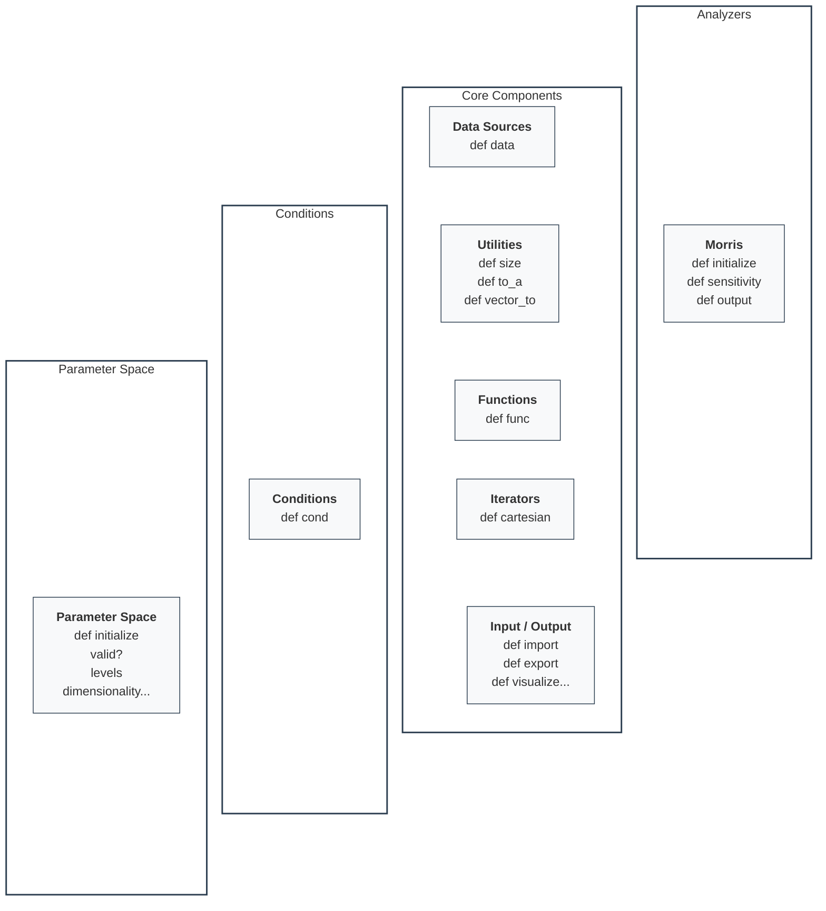

```mermaid
flowchart TB
    %% 1. Сплошные контуры для слоев (убран stroke-dasharray)
    classDef layer fill:#ffffff,stroke:#2c3e50,stroke-width:2px;
    classDef default fill:#f8f9fa,stroke:#2c3e50,stroke-width:1px,color:#333;
    
    %% Класс для прозрачных блоков-распорок
    classDef spacer fill:none,stroke:none,color:transparent;

    subgraph Analyzers ["Analyzers"]
        direction LR
        A1[" "] ~~~ A2[" "] ~~~ M["<b>Morris</b><br/>def initialize<br/>def sensitivity<br/>def output"] ~~~ A3[" "] ~~~ A4[" "]
    end

    subgraph Core ["Core Components"]
        direction LR
        DS["<b>Data Sources</b><br/>def data"] ~~~ UT["<b>Utilities</b><br/>def size<br/>def to_a<br/>def vector_to"] ~~~ FN["<b>Functions</b><br/>def func"] ~~~ IT["<b>Iterators</b><br/>def cartesian"] ~~~ IO["<b>Input / Output</b><br/>def import<br/>def export<br/>def visualize..."]
    end

    subgraph Cond ["Conditions"]
        direction LR
        C1[" "] ~~~ C2[" "] ~~~ C["<b>Conditions</b><br/>def cond"] ~~~ C3[" "] ~~~ C4[" "]
    end

    subgraph Params ["Parameter Space"]
        direction LR
        P1[" "] ~~~ P2[" "] ~~~ PS["<b>Parameter Space</b><br/>def initialize<br/>valid?<br/>levels<br/>dimensionality..."] ~~~ P3[" "] ~~~ P4[" "]
    end

    %% 2 и 3. Невидимая вертикальная шнуровка для идеальной сетки
    %% Задает одинаковую ширину контейнеров и притягивает их друг к другу без стрелок
    A1 ~~~ DS ~~~ C1 ~~~ P1
    A2 ~~~ UT ~~~ C2 ~~~ P2
    M  ~~~ FN ~~~ C  ~~~ PS
    A3 ~~~ IT ~~~ C3 ~~~ P3
    A4 ~~~ IO ~~~ C4 ~~~ P4

    %% Применение стилей
    class Analyzers,Core,Cond,Params layer;
    class A1,A2,A3,A4,C1,C2,C3,C4,P1,P2,P3,P4 spacer;
```
