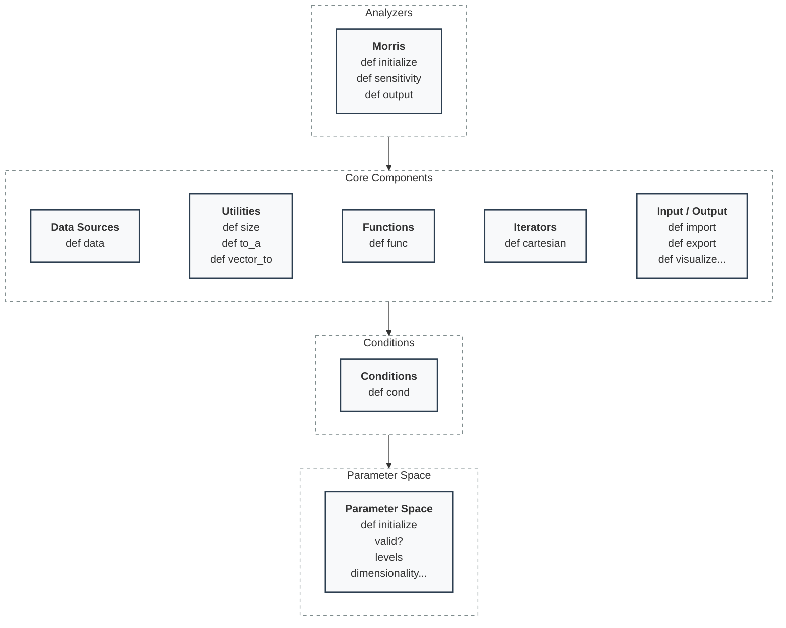

```mermaid
flowchart TD
    %% Глобальное направление: сверху вниз
    direction TB

    subgraph Analyzers ["Analyzers"]
        M["<b>Morris</b><br/>def initialize<br/>def sensitivity<br/>def output"]
    end

    subgraph Core ["Core Components"]
        %% Локальное направление: слева направо
        direction LR
        
        DS["<b>Data Sources</b><br/>def data"]
        UT["<b>Utilities</b><br/>def size<br/>def to_a<br/>def vector_to"]
        FN["<b>Functions</b><br/>def func"]
        IT["<b>Iterators</b><br/>def cartesian"]
        IO["<b>Input / Output</b><br/>def import<br/>def export<br/>def visualize..."]
        
        %% Невидимые связи для жесткого горизонтального выравнивания
        DS ~~~ UT ~~~ FN ~~~ IT ~~~ IO
    end

    subgraph Cond ["Conditions"]
        C["<b>Conditions</b><br/>def cond"]
    end

    subgraph Params ["Parameter Space"]
        PS["<b>Parameter Space</b><br/>def initialize<br/>valid?<br/>levels<br/>dimensionality..."]
    end

    %% Связи между слоями
    Analyzers --> Core
    Core --> Cond
    Cond --> Params

    %% Немного стилизации для читаемости (опционально)
    classDef default fill:#f8f9fa,stroke:#2c3e50,stroke-width:2px,color:#333;
    classDef layer fill:#ffffff,stroke:#7f8c8d,stroke-width:1px,stroke-dasharray: 5 5;
    
    class Analyzers,Core,Cond,Params layer;
```
