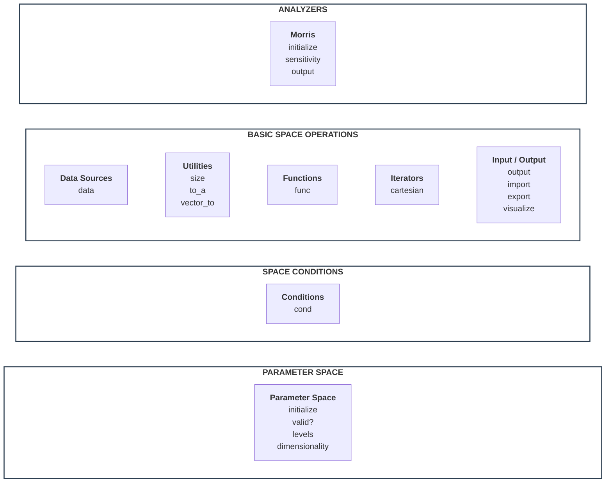

# FlexCartesian Stack

FlexCartesian represents a system using Parametric Behaviour Blueprinting stack, as given below.
Component titles are clickable, and they refer to the description and API of the component.



## STACK COMPONENTS

### Parameter Space

Parameter space is a space formed as multi-dimensional Cartesian product of the dimensions represented by discrete dimensional values.

```ruby
def initialize(dims = nil, path: nil, format: :json, source: nil, uri: nil, dimensions: nil, separator: ',')
```

Create parameter space. A space can be created in two ways.

Firstly, an empty space can be created from the description of dimensions:

- `dims` hash of dimensions (key) and array of dimensional values (value)
- `path` to the file describing dimensions
- `format` format of the file describing dimensions, either JSON or YAML

Secondly, a space can be created from a tabular data source. In this approach, dimensions are automatically created from specified columns in the data source, and dimensional values will be filled in from these columns. The resulting space will be empty, but entire the data source will remain available to link the data to behavioural functions, if needed. This method is very powerful - effectively, it allows for the creation of a live behavioural blueprint which evolves in time synchronously with the evolution of the data in the data source.

- `source` data source type, one of `:xlsx` or `:csv`
- `uri` local path to the data source file
- `dimensions` array of symbolic column names in the data source that will become space dimensions
- `separator` separation symbol in the data source file, either colon or semicolon

#### Check validity of the vector in parameter space

```ruby
def valid?(vector)
```

Check if `vector` has consistent dimensiality, consistent dimensional values, and satisfies conditions in the current space.

#### Get dimensional values

```ruby
def values
```

Return array of arrays of dimensional values.

#### Get dimensiality

```ruby
def dimensiality
```

Return number of dimensions in the current space.

### Space Conditions

Condition is a logical function defined in parameter space.
Condition restricts the space to the subset of vectors that satisfy this condition.

A space can have arbitraty number of conditions, and they apply using logical AND.
This means, conditions restrict the space to the subset that satisfies ALL of them.

All layers of the stack higher up respect conditions - that is, when a method applies to space, effectively it applies only to its subset defined by the conditions.
For example, if `cartesian` iterator iterates over space, it actually iterates over its subset defined by the conditions.

#### Managing Conditions

```ruby
  def cond(command = :print, index: nil, &block)
```

- `command` `:print` prints active space conditions, `:set` adds new conditions as a block, `:unset` removes specific condition by its `index` or all conditions if `index` isn't specified
- `index` identifies condition set in the space; index is assigned automatically, because conditions have no names (unlike functions)
- `block` body of the condition being added; it must return either `true` or `false`


